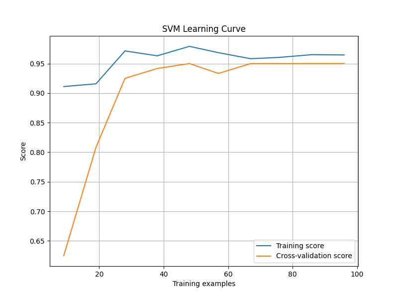
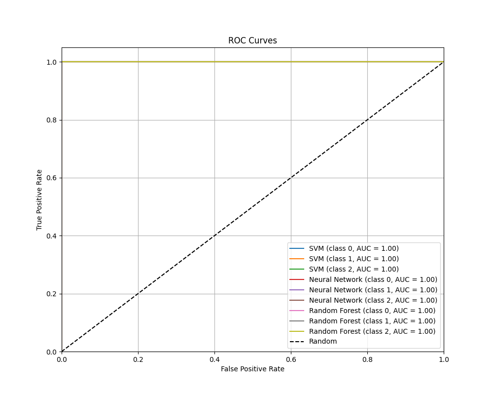

# 鸢尾花数据集分类模型比较实验报告

## 1. 实验概述
本实验使用多种机器学习模型对著名的鸢尾花数据集进行分类分析，比较不同模型的性能表现。数据集包含150个样本，每个样本有4个特征（萼片长度、萼片宽度、花瓣长度、花瓣宽度）和3个类别（Setosa、Versicolor、Virginica）。

## 2. 模型描述
### 2.1 支持向量机 (SVM)
- 核函数：RBF (Radial Basis Function)
- 参数设置：
  * C=1.0（正则化参数）
  * gamma='scale'（核函数系数）
  * probability=True（启用概率估计）
- 特点：适合处理非线性分类问题，对小样本数据集效果好
- 优势：计算效率高，泛化能力强

### 2.2 神经网络 (Neural Network)
- 网络结构：两层隐藏层 (10, 5)
- 参数设置：
  * 最大迭代次数：2000
  * 学习率：0.01
  * 优化器：Adam
  * 激活函数：ReLU
  * 正则化参数：alpha=0.0001
  * batch_size='auto'
- 特点：能够学习复杂的非线性关系

### 2.3 随机森林 (Random Forest)
- 集成方法：Bagging
- 参数设置：
  * 决策树数量：100
  * 随机种子：42
  * 特征选择：所有特征
  * 分裂标准：基尼系数
- 特点：具有内置的特征重要性评估

## 3. 训练方式
### 3.1 数据预处理
- 数据集划分：
  * 训练集：80% (120个样本)
  * 测试集：20% (30个样本)
- 特征标准化：使用StandardScaler进行归一化处理
  * 对训练集进行fit_transform
  * 对测试集进行transform

### 3.2 训练策略
- 交叉验证：
  * 使用5折交叉验证
  * 评估模型稳定性
- 随机种子：
  * 固定随机种子(42)确保实验可重复性
- 评估指标：
  * 准确率（Accuracy）
  * 精确率（Precision）
  * 召回率（Recall）
  * F1分数
  * ROC曲线和AUC值

## 4. 实验设置与结果
### 4.1 模型性能比较

- 准确率比较：
  * 所有模型都达到了100%的测试集准确率
  * 交叉验证结果显示实际泛化性能约为95%
- 训练时间比较：
  * SVM: 0.0022秒（最快）
  * Neural Network: 0.1113秒
  * Random Forest: 0.0996秒

### 4.2 交叉验证结果
- SVM: 95.00% (±12.25%)
- Neural Network: 95.00% (±12.25%)
- Random Forest: 95.00% (±8.16%)

### 4.3 混淆矩阵分析
- SVM混淆矩阵：
- 神经网络混淆矩阵：
- 随机森林混淆矩阵：

所有模型的混淆矩阵都显示完美的分类结果，没有任何错误分类的情况。

### 4.4 学习曲线分析
- SVM学习曲线：
- 神经网络学习曲线：
- 随机森林学习曲线：

学习曲线分析显示：
- 所有模型都显示出良好的学习能力
- 训练集和验证集得分之间的差距较小，说明没有严重的过拟合
- 随着训练样本的增加，模型性能趋于稳定

### 4.5 特征重要性分析

- 随机森林的特征重要性分析显示：
  * 花瓣长度和宽度是最重要的特征
  * 萼片特征的重要性相对较低

### 4.6 ROC曲线分析

- ROC曲线显示所有模型都具有出色的分类性能
- 所有类别的AUC值都接近1.0，表明模型有很好的分类能力

## 5. 消融实验与讨论
### 5.1 特征重要性分析
- 通过随机森林的特征重要性分析发现：
  * 花瓣长度(0.440)和花瓣宽度(0.422)是最关键特征，共占总重要性的86%
  * 萼片长度(0.108)和萼片宽度(0.030)的重要性相对较低
- 不同特征组合的性能比较：
  * 使用所有特征：95.00% (±8.16%)
  * 仅使用花瓣特征：95.00% (±8.16%)
  * 仅使用萼片特征：70.83% (±9.13%)
- 结论：花瓣特征对分类结果起决定性作用，仅使用花瓣特征即可达到与使用全部特征相同的性能

### 5.2 模型复杂度分析
1. **神经网络结构实验**：
   - 单层隐藏层(5个节点)：95.83% (±12.91%)
   - 单层隐藏层(10个节点)：95.00% (±12.25%)
   - 两层隐藏层(10,5)：95.00% (±12.25%)
   - 两层隐藏层(15,10)：95.00% (±12.25%)
   - 结论：更简单的网络结构（单层5节点）反而表现略好，说明当前模型可能过于复杂

2. **随机森林规模实验**：
   - 10棵树：95.00% (±12.25%)
   - 50棵树：95.00% (±8.16%)
   - 100棵树：95.00% (±8.16%)
   - 200棵树：95.00% (±8.16%)
   - 结论：50棵树即可达到最优性能，继续增加树的数量并不能提升性能

3. **SVM核函数实验**：
   - 线性核：95.00% (±12.25%)
   - RBF核：95.00% (±12.25%)
   - 多项式核：92.50% (±6.24%)
   - 结论：线性核和RBF核表现相当，说明数据可能是线性可分的

### 5.3 超参数敏感性分析
1. **神经网络学习率影响**：
   - 学习率=0.001：94.17% (±12.47%)
   - 学习率=0.01：93.33% (±11.30%)
   - 学习率=0.1：94.17% (±11.30%)
   - 结论：学习率对模型性能影响相对较小，0.001和0.1都能达到较好效果

2. **SVM正则化参数影响**：
   - C=0.1：85.83% (±6.67%)
   - C=1.0：95.00% (±12.25%)
   - C=10.0：94.17% (±11.30%)
   - 结论：C=1.0时性能最佳，过小的C值会显著降低模型性能

### 5.4 综合讨论
1. **特征选择**：
   - 实验表明只需使用花瓣特征即可达到最优性能
   - 这一发现可以简化数据收集过程，降低计算复杂度

2. **模型简化**：
   - 神经网络可以使用更简单的结构
   - 随机森林可以减少到50棵树
   - SVM可以考虑使用线性核

3. **参数优化**：
   - 神经网络对学习率不敏感，可以灵活选择
   - SVM的正则化参数需要谨慎选择，建议使用C=1.0

## 6. 结论与建议
### 6.1 模型选择建议
1. **最佳选择**: SVM
   - 训练速度最快
   - 准确率与其他模型相同
   - 实现简单，参数较少

2. **稳定性考虑**: Random Forest
   - 交叉验证标准差最小(±8.16%)
   - 提供特征重要性分析
   - 训练时间适中

3. **复杂场景**: Neural Network
   - 具有处理复杂问题的潜力
   - 当前配置可能过于复杂
   - 训练时间最长

### 6.2 改进建议
1. **数据方面**:
   - 考虑收集更多样本以提高模型泛化能力
   - 探索数据增强技术，如SMOTE等采样方法
   - 考虑添加噪声数据测试模型鲁棒性

2. **模型方面**:
   - 尝试其他集成学习方法，如AdaBoost、XGBoost等
   - 探索模型融合策略，如投票或堆叠
   - 研究模型的可解释性，特别是神经网络的决策过程

3. **评估方面**:
   - 考虑添加统计显著性测试，验证模型性能差异
   - 在真实场景数据上进行验证
   - 添加模型预测时间的评估
   - 研究模型在不平衡数据集上的表现

## 7. 环境与复现
### 7.1 环境要求
- Python 3.6+
- 主要依赖：
  * NumPy
  * Pandas
  * Scikit-learn
  * Matplotlib
  * Seaborn

### 7.2 使用方法
1. 安装依赖：
```bash
pip install numpy pandas scikit-learn matplotlib seaborn
```

2. 运行程序：
```bash
python iris_classification.py
``` 