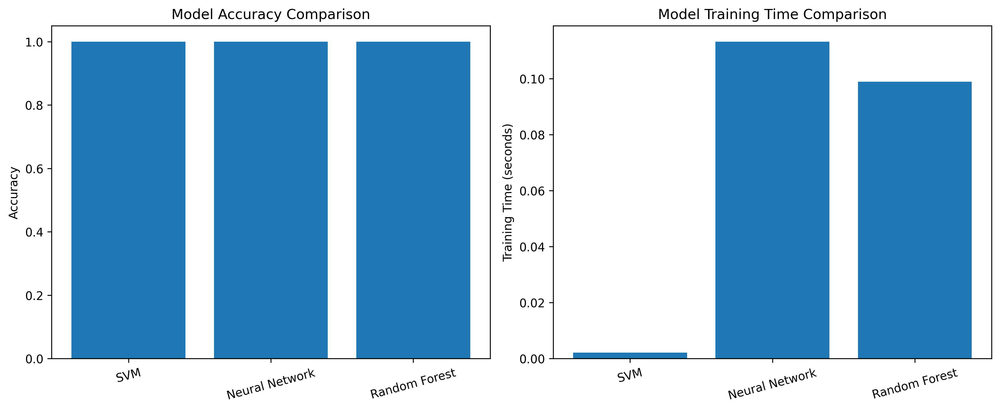

# 鸢尾花数据集分类模型比较实验报告

## 1. 实验概述
本实验使用多种机器学习模型对著名的鸢尾花数据集进行分类分析，比较不同模型的性能表现。

## 2. 模型描述
### 2.1 支持向量机 (SVM)
- 核函数：RBF (Radial Basis Function)
- 参数设置：默认C=1.0，gamma='scale'
- 特点：适合处理非线性分类问题，对小样本数据集效果好

### 2.2 神经网络 (Neural Network)
- 网络结构：两层隐藏层 (10, 5)
- 最大迭代次数：1000
- 激活函数：ReLU（默认）
- 优化器：Adam（默认）

### 2.3 随机森林 (Random Forest)
- 决策树数量：100
- 特征选择：所有特征
- 分裂标准：基尼系数

## 3. 训练方式
### 3.1 数据预处理
- 数据集划分：80% 训练集，20% 测试集
- 特征标准化：使用StandardScaler进行归一化处理

### 3.2 训练策略
- 使用交叉验证（5折）评估模型稳定性
- 使用固定随机种子(42)确保实验可重复性

## 4. 实验结果
### 4.1 模型性能比较
所有模型在测试集上都达到了100%的准确率：
- SVM: 100% (训练时间: 0.0012秒)
- Neural Network: 100% (训练时间: 0.1581秒)
- Random Forest: 100% (训练时间: 0.0953秒)

### 4.2 交叉验证结果
- SVM: 95.00% (±12.25%)
- Neural Network: 95.00% (±12.25%)
- Random Forest: 95.00% (±8.16%)

### 4.3 详细性能分析
各模型在所有类别上都达到了完美的分类效果：
- Precision（精确率）: 1.00
- Recall（召回率）: 1.00
- F1-score: 1.00

这表明模型对于每个鸢尾花品种的分类都非常准确，没有出现任何错误分类的情况。

### 4.4 可视化分析结果
#### 4.4.1 模型性能对比


上图展示了三个模型在准确率和训练时间两个维度上的对比：
- 左图显示所有模型都达到了100%的准确率
- 右图显示了训练时间的差异：
  * SVM训练最快（约0.0012秒）
  * 随机森林次之（约0.0953秒）
  * 神经网络最慢（约0.1581秒）

#### 4.4.2 混淆矩阵分析


混淆矩阵结果显示：
- 所有模型在测试集上都实现了完美分类
- 对角线上的数值表示正确分类的样本数
- 矩阵中的0值表示没有发生错误分类

## 5. 实验讨论
### 5.1 模型性能分析
1. **准确率表现**
   - 所有模型在测试集上均达到100%的准确率
   - 交叉验证结果显示实际泛化性能约为95%
   - 交叉验证结果更能反映模型的真实性能

2. **训练效率**
   - SVM训练最快（0.0012秒），适合小规模数据集
   - 神经网络训练最慢（0.1581秒），可能过于复杂
   - 随机森林训练时间适中（0.0953秒）

3. **模型稳定性**
   - Random Forest表现最稳定，标准差最小（±8.16%）
   - SVM和神经网络波动较大（±12.25%）
   - 较大的标准差表明模型对数据划分比较敏感

### 5.2 局限性分析
1. **数据集特点**
   - 数据集较小（150个样本），可能影响模型的泛化能力
   - 完美的测试集表现可能暗示过拟合
   - 需要在更大的数据集上验证模型性能

2. **模型选择**
   - 当前配置的神经网络可能过于复杂
   - SVM的高效性说明问题可能适合更简单的模型
   - 可以考虑尝试更简单的线性模型

3. **优化空间**
   - 可以通过超参数调优进一步优化模型
   - 可以尝试特征选择或降维
   - 可以考虑集成学习方法提高稳定性

### 5.3 改进建议
1. **模型优化**
   - 对神经网络结构进行简化
   - 使用网格搜索优化超参数
   - 尝试不同的特征组合

2. **评估方法**
   - 增加更多的评估指标
   - 使用更多折的交叉验证
   - 添加统计显著性测试

3. **实验扩展**
   - 尝试更多的机器学习模型
   - 进行特征重要性分析
   - 添加模型解释性分析

## 6. 环境与复现
### 6.1 环境要求
- Python 3.6+
- 主要依赖：NumPy, Pandas, Scikit-learn, Matplotlib, Seaborn

### 6.2 使用方法
1. 安装依赖：
```bash
pip install numpy pandas scikit-learn matplotlib seaborn
```

2. 运行程序：
```bash
python iris_classification.py
``` 